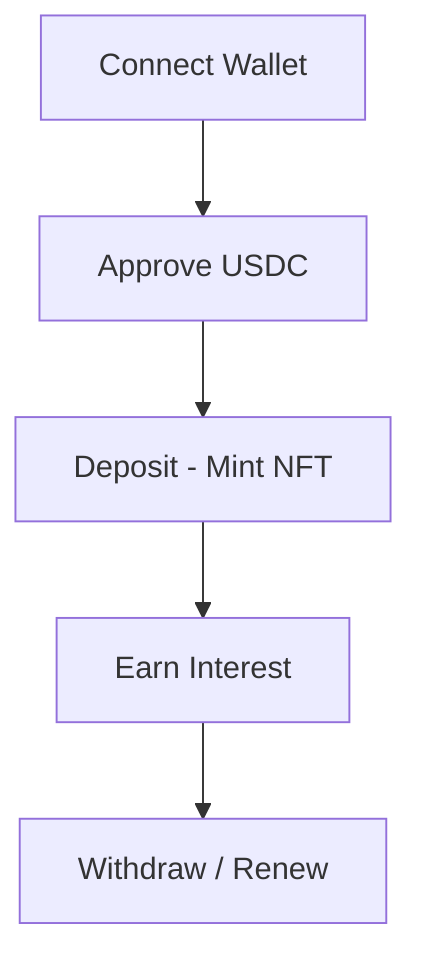

# 💎 OCFP: One Capital - Four Profits

**OCFP** is a decentralized term-deposit protocol that transforms traditional savings into high-yield, liquid NFT assets. Built with a "Neon-Noir" aesthetic, it combines DeFi yield strategies with ERC721 certificate tokens.

---

## 🏗️ System Architecture

The project is architected as a decoupled mono-repo:

- **`/backend`**: Hardhat environment containing Solidity smart contracts, automated test suites, and deployment scripts for Sepolia/Mainnet.
- **`/frontend`**: React 19 + Vite 8 application utilizing Wagmi 3 and RainbowKit for a seamless, type-safe Web3 user experience.

---

## 🛠️ Tech Stack

### Smart Contracts (Blockchain)
- **Solidity ^0.8.24**: Core logic with custom errors and optimized gas usage.
- **OpenZeppelin**: Industry-standard implementations for `ERC20`, `ERC721`, and `Ownable` security.
- **Hardhat**: Development framework for compilation, testing, and deployment.

### Application (Frontend)
- **React 19**: Modern UI component architecture.
- **Wagmi 3 & Viem 2**: Type-safe hooks for contract interaction and state management.
- **RainbowKit 2**: Premium wallet connection management.
- **TailwindCSS**: Powering the custom "Neon-Noir" design system.

---

## 📂 Project Structure

```text
.
├── backend/                # Hardhat Project
│   ├── contracts/          # SavingCore, VaultManager, MockUSDC
│   ├── scripts/            # Deployment & Local Demo scripts
│   └── test/               # Comprehensive Test suite
├── frontend/               # React Project
│   ├── src/
│   │   ├── abis/           # Synced Contract ABIs
│   │   ├── components/     # UI Design System
│   │   └── constants/      # Multi-network addresses
│   └── public/             # Static Assets
└── README.md               # Project Documentation (Root)
```

---

## 🔗 Smart Contract Summary

1. **`SavingCore.sol`**: The engine of the protocol. Handles deposit logic, NFT minting, and interest calculation.
2. **`VaultManager.sol`**: Manages the protocol's liquidity pool, fee structures, and administrative funding.
3. **`MockUSDC.sol`**: An ERC20 test token used to simulate real-world value on testnets.

### 🛡️ Quality Assurance (Testing)
- **Unit Tests**: 100% coverage achieved for `SavingCore` and `VaultManager` logic.
- **Security**: Architected using OpenZeppelin standards; strictly verified against Reentrancy and Overflow vulnerabilities.

---

## 🚀 Quick Start (Local Development)

### 1. Setup Backend
```bash
cd backend
npm install
npx hardhat node
```

### 2. Deploy & Seed Data (New Terminal)
```bash
cd backend
npx hardhat run scripts/demo_local.js --network localhost
```

### 3. Setup Frontend
```bash
cd frontend
npm install
npm run dev
```

---

## 🌐 Deployment (Sepolia Testnet)

The system is currently deployed on the Sepolia Testnet.

**Latest Contract Addresses (Chain ID: 11155111):**
- **USDC**: `0xFd9d4200Cad64cC0798F9DD72bf1844597492935`
- **VaultManager**: `0xB7927A43BE1e057CA1FC9b5CdF482C09A1b190DE`
- **SavingCore**: `0xea99B62Cb18f7C16a690F1856A07E0AfF96352A1`

To update the frontend, ensure these addresses are reflected in `frontend/src/constants/addresses.json` under the `11155111` key.

---

## 🔄 User Flow (Demo)

1. **Connect Wallet**: Use RainbowKit to connect your wallet (e.g., MetaMask).
2. **Approve USDC**: The UI detects your allowance and prompts an `approve()` transaction.
3. **Open Deposit**: Choose a plan (30, 90, 365 days) and deposit USDC.
4. **Manage NFTs**: View your active deposits as dynamic cards. Monitor real-time interest accrual.
5. **Withdraw/Renew**: At maturity, withdraw your principal + interest, or renew for another cycle.



---

## 🛡️ Edge Case Handling

- **Insufficent Gas**: Proactive gas estimation prevents failed transactions.
- **Network Switch**: Automatic detection and prompt to switch to the correct chain (Sepolia/Hardhat).
- **User Rejection**: Graceful UI resets if the user cancels a signature in the wallet.

---

## 🔮 Future Roadmap

- **Governance**: Implementation of a DAO for adjusting APR and Fee parameters.
- **Secondary Market**: Native marketplace for trading matured NFT deposit certificates.
- **Cross-Chain**: Integration with Layer 2s (Arbitrum/Optimism) for lower gas costs.

---

## 📜 License & Contact
- **License**: MIT
- **GitHub**: [Your GitHub Profile]
- **Email**: [Your Email Address]
