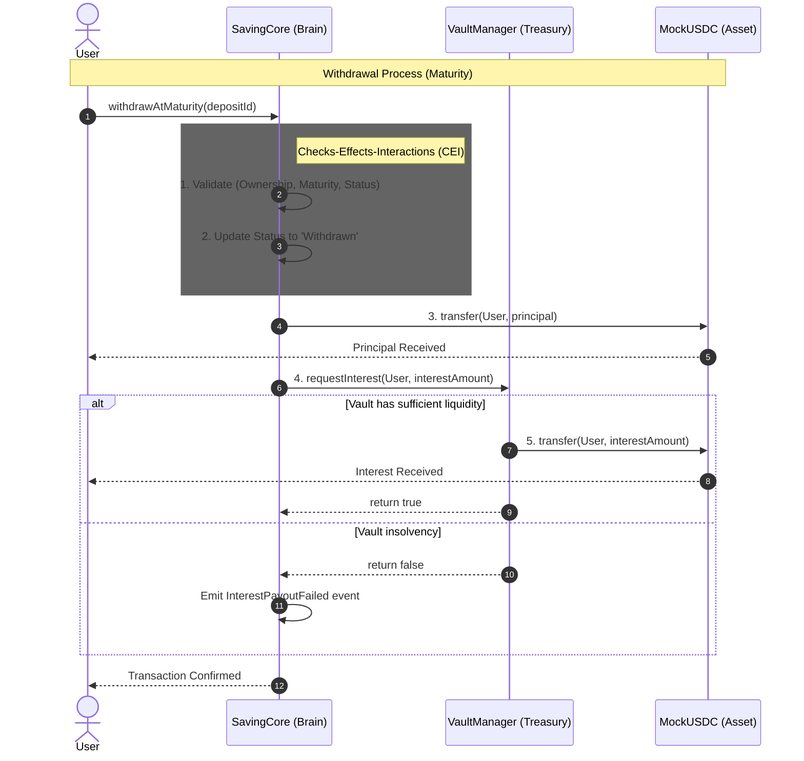

# 🏦 Decentralized Term-Deposit & Savings Ecosystem

[](https://soliditylang.org/)
[](https://hardhat.org/)
[](https://opensource.org/licenses/MIT)

A production-grade, non-custodial savings protocol that leverages NFT-based deposit certificates to provide transparent, automated, and secure term-deposits on the Ethereum blockchain.

---

## 🎯 Project Overview & Vision

The **Blockchain Savings System** is designed to replace opaque, centralized financial products with a trustless, on-chain alternative. By utilizing a dual-contract architecture, the protocol separates core business logic from treasury management, ensuring higher security standards and capital efficiency.

### 💡 Key Innovations
- **NFT-based Certificates**: Every deposit is represented by an ERC721 NFT (Saving Certificate NFT - SCN). This enables liquidity through secondary markets and seamless integration with other DeFi protocols.
- **Treasury Isolation**: Funds for interest payments are managed by a dedicated `VaultManager`, protecting user principal from administrative risks.
- **Automated Compounding**: A system-triggered auto-renewal mechanism allows users to compound interest indefinitely without manual intervention.

---

## 🏗️ System Architecture

The protocol is split into three primary components:

1.  **`SavingCore.sol` (The Brain)**: Handles user interactions, NFT lifecycle (minting/burning), and the state machine for all deposits.
2.  **`VaultManager.sol` (The Treasury)**: Manages liquidity for interest payouts and enforces administrative safety buffers.
3.  **`MockUSDC.sol` (The Asset)**: A standard ERC20 token used as the settlement asset (simulating real USDC).

### 📐 Design Decisions & "The Why"
- **Why NFT instead of Mapping?**
    - *Tradability*: Users can sell their "locked" deposits on marketplaces if they need immediate liquidity without triggering protocol-level early withdrawal penalties.
    - *Composability*: Other protocols (e.g., lending platforms) can recognize the NFT as collateral.
- **Why Vault Separation?**
    - *Risk Mitigation*: User principal remains in `SavingCore`, while interest funds stay in `VaultManager`. Even if the treasury is depleted, user principal is isolated and recoverable.
    - *Access Control*: It allows for granular permissioning where only `SavingCore` can request interest payouts.
- **Why Simple Interest?**
    - *Gas Efficiency*: Calculating complex compound interest on-chain at every block is prohibitively expensive. This system snapshots the APR at entry and calculates accrued interest at the moment of withdrawal or renewal.

## 🔁 Contract Interaction Flow

The protocol follows a decoupled architecture to enforce trust boundaries and minimize the attack surface.

```text
    User
      │
      ▼
  SavingCore (Brain) ───────┐
      │                     │
      │ 1. Validate         │ 2. Request Interest
      │ 3. Update State     │
      ▼                     ▼
  ERC20 (USDC) ◄──── VaultManager (Treasury)
      │                     │
      └──────────┬──────────┘
                 │
                 ▼
                User
```

1. **User Interaction**: All state-changing operations are gated by `SavingCore`. Users never interact with the treasury directly.
2. **Trust Boundaries**: `VaultManager` exposes a restricted `requestInterest` function, accessible only via the `onlySavingCore` modifier.
3. **Liquidity Isolation**: Principal is siloed in `SavingCore`. Interest is managed by `VaultManager`. This prevents a compromise in yield logic from affecting the safety of the underlying principal.



## 📡 Event-Driven Design

The protocol is built with a "Front-end First" event philosophy. Every state transition emits a detailed event to support:
- **Indexers (TheGraph/Subquery)**: All `Withdrawn`, `Renewed`, and `PlanUpdated` events are designed for easy indexing to provide historical performance data.
- **Automated Bots**: The `autoRenew` system monitors `Renewed` events to track the lifecycle of certificates and trigger the next compounding cycle precisely after the grace period.
- **UI Responsiveness**: The frontend uses `Wagmi` hooks to listen for real-time events, ensuring the dashboard reflects state changes (e.g., successful compounding) immediately upon block confirmation.


---

## 🔄 Execution Flows

### 1. Deposit Flow
1.  **Approval**: User calls `ERC20.approve(...)`, setting the allowance for `SavingCore`. The subsequent `transferFrom()` call will revert if the balance or allowance is insufficient.

2.  **Validation**: `SavingCore` performs `require(plan.enabled)` and checks `minDeposit`/`maxDeposit` bounds.
3.  **Transfer**: Calls `ERC20.transferFrom(msg.sender, address(this), amount)`. **Critical**: This follows the CEI pattern—validation happens before the external call.
4.  **State Update**: Increments `nextDepositId`, initializes `DepositCertificate` struct with snapshotted APR and maturity timestamp.
5.  **Minting**: `_mint(msg.sender, depositId)` assigns NFT ownership. Status is set to `Active`.

### 2. Withdrawal Flow
-   **At Maturity**:
    1.  **Auth**: `require(ownerOf(depositId) == msg.sender)`.
    2.  **State Check**: `require(deposit.status != Status.Withdrawn)`.
    3.  **Timing**: `require(block.timestamp >= deposit.maturityAt)`.
    4.  **CEI Pattern**: Status is updated to `Withdrawn` **BEFORE** any token transfers to prevent reentrancy.
    5.  **Execution**: `ERC20.transfer(msg.sender, principal)`. `SavingCore` then calls `VaultManager.requestInterest()`.
-   **Early Withdrawal**:
    1.  **Penalty Calc**: Calculates penalty BPS. `amountToUser = principal - penalty`.
    2.  **Execution**: `ERC20.transfer(vault.feeReceiver(), penalty)` and `ERC20.transfer(msg.sender, amountToUser)`. No interest is requested.
-   **Emergency Withdrawal**:
    1.  Bypasses `whenNotPaused` modifier.
    2.  Withdraws **Principal ONLY**. Designed to ensure capital recovery even if `VaultManager` interest payout logic is compromised or paused.

### 3. Renewal Flow
- **Manual Renew**: Permitted strictly during the 3-day **Grace Period**. It compounds accrued interest by requesting a transfer from `VaultManager` and updating `deposit.principal`.
- **Auto Renew**: Triggered by a **privileged executor role**. It enforces a 10-cycle "APR Freeze" to protect users from administrative rate volatility during automated compounding. Future iterations will transition this to **Chainlink Automation** for full decentralization.


---

## ❌ Failure Scenarios & Edge Cases

A robust protocol is defined by how it handles failure. This system is hardened against the following:

- **Double Withdrawal Attempt**: The state machine updates the status to `Withdrawn` **before** the external transfer. Subsequent calls trigger a `Status` revert, neutralizing reentrancy or replay attempts.
- **Vault Insolvency**: If `VaultManager` has insufficient liquidity, `requestInterest` returns `false` and `SavingCore` emits an `InterestPayoutFailed` event. The transaction **does not revert**, ensuring that principal withdrawal remains atomic and cannot be blocked by treasury conditions.


- **Auto-Renew Front-running**: If the system tries to `autoRenew` while the user is still in the 3-day grace period, the call reverts with `Inside grace period`, protecting the user's right to manual intervention.
- **Disabled Plan Usage**: `openDeposit` and `manualRenew` both verify `plans[id].enabled`. If an admin disables a plan, no new deposits or renewals can enter that plan.
- **Paused Contract Behavior**: The `whenNotPaused` modifier blocks all standard operations. However, `emergencyWithdraw` is explicitly excluded from this modifier to ensure users can always exit their positions in a crisis.
- **Invalid NFT Ownership**: All critical functions perform an `ownerOf(depositId) == msg.sender` check. Even if a user knows a valid `depositId`, they cannot act on it unless they hold the corresponding NFT.

---


## 🛡️ Security & Risk Management

### 1. Reentrancy Protection (CEI Pattern)
The protocol strictly adheres to the **Checks-Effects-Interactions (CEI)** pattern. In all withdrawal and renewal sequences, internal state—such as `deposit.status = Withdrawn`—is updated **before** any external ERC20 calls. This intentional design choice eliminates the need for a `ReentrancyGuard` modifier, reducing gas overhead while maintaining robust security.


### 2. Double-Spend & State Machine
The `Status` enum (`Active`, `Withdrawn`, `ManualRenewed`, `AutoRenewed`) acts as a strictly enforced state machine. Once a certificate enters the `Withdrawn` state, it is logically "burnt" within the protocol, making any further interaction impossible.

### 3. Vault Insolvency Mitigation
Interest payouts are treated as "Best Effort". If the `VaultManager` balance is insufficient, the system fails gracefully by returning the user's principal and emitting an error event. This decoupling ensures that a liquidity crunch in the interest pool doesn't become a solvency crisis for the users' principal.

### 4. Access Control (Least Privilege)
- **`onlyOwner`**: Restricted to high-level plan configuration and emergency pausing.
- **`onlySavingCore`**: `VaultManager` trusts **only** the `SavingCore` contract to request payouts, preventing direct treasury draining by external actors.
- **Modifiable Fee Receiver**: Ensures penalties can be routed to a DAO treasury or insurance fund.

### 5. Precision Math
All calculations use **Basis Points (BPS)** where 10000 = 100%. This ensures 0.01% precision and avoids floating-point errors inherent in EVM.


---

## ⚙️ Technical Setup & Installation

### Prerequisites
- Node.js v18+
- NPM / Yarn

### 1. Clone & Install
```bash
git clone https://github.com/your-repo/blockchain-savings-system.git
cd blockchain-savings-system
npm install
```

### 2. Environment Setup
Create a `.env` file in the root:
```env
SEPOLIA_RPC_URL=your_rpc_url
PRIVATE_KEY=your_wallet_private_key
ETHERSCAN_API_KEY=your_etherscan_key
```

### 3. Compile & Test
```bash
# Compile contracts
npx hardhat compile

# Run full test suite
npx hardhat test

# Check coverage
npx hardhat coverage
```

### 4. Local Deployment
```bash
npx hardhat node
npx hardhat run scripts/demo_local.js --network localhost
```

---

## 🧪 Testing Strategy

The protocol is backed by a comprehensive test suite using **Hardhat** and **Ethers.js**, achieving **>98% line coverage** across all core logic.

### Test Categories
- **Unit Testing**: Isolated testing of `SavingCore` logic, interest formulas, and state transitions.
- **Integration Testing**: End-to-end flows involving `SavingCore`, `VaultManager`, and `MockUSDC`.
- **Time Manipulation**: Extensive use of `hardhat-network-helpers` (`time.increase`) to simulate maturity, grace periods, and multi-year compounding cycles.
- **Edge Case Suite**: Tests for vault insolvency, zero-value deposits, and unauthorized administrative overrides.

To run tests with coverage:
```bash
npx hardhat coverage
```

---

## 🚀 Deployment (Testnet)

The protocol is optimized for deployment on the **Ethereum Sepolia** testnet. Follow these steps to deploy the entire ecosystem (MockUSDC, VaultManager, SavingCore) and initialize the savings plans.

### 1. Environment Configuration
Ensure your `.env` file is properly configured with a funded account:
```env
SEPOLIA_RPC_URL=https://eth-sepolia.g.alchemy.com/v2/your-api-key
PRIVATE_KEY=0x...your_private_key
ETHERSCAN_API_KEY=your_etherscan_api_key
```

### 2. Execute Deployment Script
The deployment script handles contract orchestration, system linking, and initial plan creation:
```bash
npx hardhat run scripts/deploy_sepolia.js --network sepolia
```

### 3. Post-Deployment Verification
Upon successful execution, the script will output the contract addresses. It is recommended to verify the contracts on Etherscan for transparency:
```bash
npx hardhat verify --network sepolia <CONTRACT_ADDRESS> <CONSTRUCTOR_ARGS>
```

---

## 📂 Project Structure

```text
blockchain-savings-system
├── backend/
│   ├── contracts/            # Smart Contract logic
│   │   ├── SavingCore.sol    # Core logic & NFT management
│   │   ├── VaultManager.sol  # Treasury & interest management
│   │   └── MockUSDC.sol      # Mock token for testing
│   ├── scripts/              # Deployment & Demo scripts
│   ├── test/                 # Comprehensive Chai/Mocha tests
│   └── hardhat.config.js     # Hardhat configuration
└── frontend/                # Frontend (React/Vite)
```

---

## 🔬 Example Scenario

User deposits 1,000 USDC into a 90-day plan at 10% APR.

- Interest ≈ 1,000 * 10% * (90 / 365)
- ≈ 24.65 USDC

Total payout at maturity ≈ 1,024.65 USDC


## 🧠 Engineering Insights & Trade-offs

### 🏆 Signature Engineering Insight: Vault-Core Decoupling
One key design decision in this system is the strict separation between the `SavingCore` (Principal Ledger) and the `VaultManager` (Interest Treasury). 

By decoupling these concerns, we achieve **Liquidity Safety**. In most savings protocols, interest and principal are co-mingled, meaning a failure to pay interest could theoretically lock the principal. In this architecture, `SavingCore` holds the principal and only "queries" the `VaultManager` for interest. If the Vault is empty, the query fails gracefully, but the principal transfer remains atomic and independent. This "Principal-First" philosophy ensures that users can always recover their initial capital, regardless of the protocol's interest-paying capacity.

### Additional Considerations
-   **Gas packing**: We used a `Status` enum and grouped `uint256` variables in the `DepositCertificate` struct to optimize storage slots.
-   **State Machine**: The explicit `Status` state machine prevents "Double Withdrawal" attacks and provides a clear audit trail for off-chain indexing.
-   **Snapshotting**: APR is snapshotted at the time of deposit. This provides "Locked-In" rates for users, protecting them from protocol-level rate changes during their term.


---

## ⚠️ Limitations & Future Work

-   **Centralization**: The `autoRenew` function currently relies on a centralized system bot. Future iterations will explore **Chainlink Automation** for decentralization.
-   **Fixed Collateral**: Currently only supports `MockUSDC`. A production version would implement a generic `IERC20` interface for multi-collateral support.
-   **Non-Upgradeability**: Contracts are currently immutable. Implementing a Proxy pattern (UUPS) would be the next step for long-term maintenance.
-   **ERC20 Trust Assumption**: The protocol assumes standard-compliant ERC20 behavior. Malicious or non-standard token implementations are considered out of scope for this system.


---

**This system demonstrates a production-oriented DeFi architecture, prioritizing capital safety, modular design, and predictable financial behavior.**

