# 🏦 OCFP: Smart Contract Protocol

[](https://soliditylang.org/)
[](https://hardhat.org/)
[](https://github.com/Hardyex)
[](https://opensource.org/licenses/MIT)

Technical documentation for the OCFP (One Capital - Four Profits) core protocol logic, treasury management, and security architecture.

---

## 🏗️ System Architecture

The protocol is split into three primary components to ensure modularity and risk isolation:

1.  **`SavingCore.sol` (The Brain)**: Handles user interactions, NFT lifecycle (minting/burning), and the state machine for all deposits.
2.  **`VaultManager.sol` (The Treasury)**: Manages liquidity for interest payouts and enforces administrative safety buffers.
3.  **`MockUSDC.sol` (The Asset)**: A standard ERC20 token used as the settlement asset (simulating real USDC).

### 📐 Design Decisions & "The Why"
- **Why NFT instead of Mapping?**
    - *Tradability*: Users can sell their "locked" deposits on marketplaces for immediate liquidity.
    - *Composability*: Enables the deposit certificate to be used as collateral in other DeFi protocols.
- **Why Vault Separation?**
    - *Risk Mitigation*: User principal is siloed in `SavingCore`, while yield funds stay in `VaultManager`. Even if the treasury is depleted, user principal remains isolated and recoverable.
- **Why Simple Interest?**
    - *Gas Efficiency*: Calculations are performed only at withdrawal or renewal, snapshotting the APR at entry to avoid expensive per-block compounding overhead.

---

## 🔁 Contract Interaction Flow

The protocol follows a decoupled architecture to enforce trust boundaries.

```mermaid
sequenceDiagram
    autonumber
    actor User
    participant SC as SavingCore (Brain)
    participant VM as VaultManager (Treasury)
    participant USDC as MockUSDC (Asset)

    Note over User, USDC: Withdrawal Process (Maturity)

    User->>SC: withdrawAtMaturity(depositId)
    
    rect rgb(30, 30, 30)
        Note right of SC: Checks-Effects-Interactions (CEI)
        SC->>SC: 1. Validate (Ownership, Maturity, Status)
        SC->>SC: 2. Update Status to 'Withdrawn'
    end

    SC->>USDC: 3. transfer(User, principal)
    SC->>VM: 4. requestInterest(User, interestAmount)
    
    alt Vault has sufficient liquidity
        VM->>USDC: 5. transfer(User, interestAmount)
        VM-->>SC: return true
    else Vault insolvency
        VM-->>SC: return false
        SC->>SC: Emit InterestPayoutFailed event
    end
    
    SC-->>User: Transaction Confirmed
```



---

## 🔄 Execution Flows

### 1. Deposit Flow
1.  **Approval**: User calls `ERC20.approve(...)` for `SavingCore`.
2.  **Validation**: `SavingCore` checks if the plan is enabled and within `min`/`max` deposit bounds.
3.  **Transfer**: `ERC20.transferFrom(msg.sender, address(this), amount)`. (Follows CEI).
4.  **State Update**: Initializes `DepositCertificate` with snapshotted APR and maturity.
5.  **Minting**: `_mint(msg.sender, depositId)` assigns NFT ownership.

### 2. Withdrawal Flow
-   **At Maturity**: Validates ownership and timing. Updates status to `Withdrawn` **BEFORE** transfers. Executes principal transfer followed by `VaultManager.requestInterest()`.
-   **Early Withdrawal**: Calculates penalty BPS. Transfers penalty to `VaultManager` and principal - penalty to user. No interest is paid.
-   **Emergency**: Bypasses `Pausable` state. Withdraws **Principal ONLY** to ensure capital recovery during a crisis.

### 3. Renewal Flow
- **Manual**: Allowed during a 3-day **Grace Period**. Compounds accrued interest into a new principal.
- **Auto**: Triggered by an executor. Enforces a 10-cycle "APR Freeze" to protect users from rate volatility.

---

## 🛡️ Security & Risk Management

### 1. Reentrancy Protection (CEI Pattern)
Internal state updates (e.g., `deposit.status = Withdrawn`) occur strictly **before** any external ERC20 calls. This removes the need for a `ReentrancyGuard` and reduces gas costs while maintaining absolute security.

### 2. Vault Insolvency Mitigation
Interest payouts are treated as "Best Effort". If `VaultManager` is insolvent, the transaction does not revert; instead, it returns principal and emits an event. This ensures liquidity in the interest pool never blocks principal recovery.

### 3. Access Control (Least Privilege)
- **`onlySavingCore`**: `VaultManager` restricts treasury access exclusively to the core contract.
- **State Machine**: The `Status` enum enforces a strict lifecycle for certificates, preventing double-withdrawal or unauthorized state jumps.

---

## ⚙️ Technical Setup & Installation

### 1. Environment Setup
Create a `.env` file in the root of the `smartcontract` directory:
```env
SEPOLIA_RPC_URL=your_rpc_url
PRIVATE_KEY=your_wallet_private_key
ETHERSCAN_API_KEY=your_etherscan_key
```

### 2. Compile & Test
```bash
# Compile contracts
npx hardhat compile

# Run full test suite
npx hardhat test

# Check coverage
npx hardhat coverage
```

### 3. Deployment
```bash
# Local Node
npx hardhat node
npx hardhat run scripts/demo_local.js --network localhost

# Sepolia Testnet
npx hardhat run scripts/deploy_sepolia.js --network sepolia
```

---

## 🧪 Testing Strategy

The protocol is backed by an industry-standard test suite achieving **>98% line coverage**.

- **Unit Testing**: Isolated logic validation for interest formulas and state transitions.
- **Integration Testing**: End-to-end flows between `SavingCore`, `VaultManager`, and `MockUSDC`.
- **Time Manipulation**: Simulating years of compounding using `hardhat-network-helpers`.
- **Edge Case Suite**: Rigorous testing for vault insolvency, unauthorized access, and zero-value inputs.

---

## 🧠 Engineering Insights & Trade-offs

### 🏆 Vault-Core Decoupling
By separating the Principal Ledger (`SavingCore`) from the Interest Treasury (`VaultManager`), we achieve **Liquidity Safety**. Principal is never co-mingled with yield, ensuring users can exit their initial positions even if the protocol's interest capacity is compromised.

---

## ⚠️ Limitations & Future Work
- **Decentralization**: Moving `autoRenew` to Chainlink Automation.
- **Multi-Collateral**: Implementing generic `IERC20` support beyond `MockUSDC`.
- **Upgradeability**: Future iterations will implement UUPS proxies for long-term maintenance.
